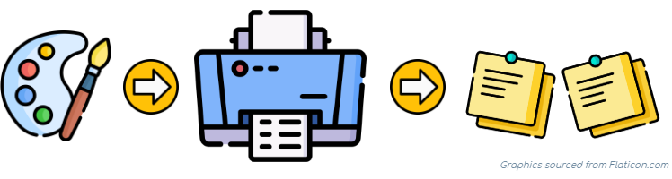

Useful templates to print on the Post-it/Sticky Notes

This work is licensed under a [Creative Commons Attribution-ShareAlike 4.0 International License](https://creativecommons.org/licenses/by-sa/4.0/)

----

### 1. Download and Print the Template
[Letter Size](https://github.com/codspire/print2sticky/raw/develop/assets/Print2Sticky_Letter_Template.pdf)  OR  [A4 Size](https://github.com/codspire/print2sticky/raw/develop/assets/Print2Sticky_A4_Template.pdf)

### 2. Stick the Blank Post-it Notes on the Template

### 3. Load the Template Sheet in the Printer
_Follow the instructions on the Template sheet while loading it in the printer tray._
### 4. Create Rich Content for Your Post-it Notes
[Letter Size](https://app.diagrams.net/#Uhttps%3A%2F%2Fraw.githubusercontent.com%2Fcodspire%2Fprint2sticky%2Fdevelop%2Fassets%2FPrint2Sticky_Letter_Editable.drawio)  OR  [A4 Size](https://app.diagrams.net/#Uhttps%3A%2F%2Fraw.githubusercontent.com%2Fcodspire%2Fprint2sticky%2Fdevelop%2Fassets%2FPrint2Sticky_A4_Editable.drawio)

### 5. Print It

TODO: Checkout the picture gallery (short video/gif)

If you prefer Post-its the old-fashion way, here is an interesting blogpost to [give your Post-its a creative touch.](https://medium.com/graphicfacilitation/how-to-create-compelling-post-it-notes-9c9845305fbc)

----
### Credits
This is made possible by https://app.diagrams.net, one of the best opensource drawing tool.